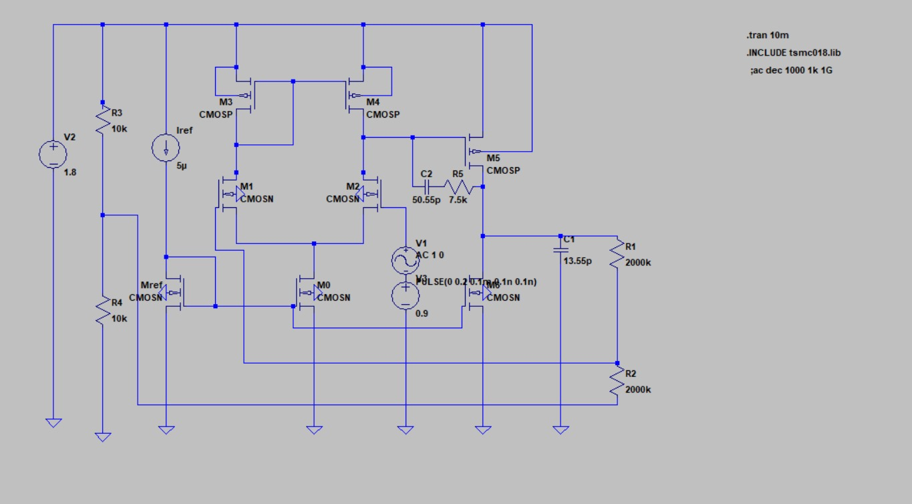

# Two-Stage Operational Transconductance Amplifier (OTA) Design

## Overview
This repository contains the schematic, design calculations, and simulation results for a CMOS Two-Stage Operational Transconductance Amplifier (OTA). The circuit is implemented using the TSMC 180nm technology node (`tsmc018.lib`) and operates on a 1.8V single supply. 

The amplifier features a differential input stage with an active current mirror load, followed by a common-source second stage. To ensure stability in a closed-loop configuration, the design employs Miller compensation with a nulling resistor to push the right-half-plane (RHP) zero to higher frequencies.

## Circuit Schematic

> *Note: The circuit is simulated in a closed-loop negative feedback configuration using a resistive voltage divider (R1 = R2 = 2000kΩ).*

## Performance Specifications
Based on the DC operating point and AC/Transient simulations, the designed OTA achieves the following performance metrics:

| Parameter | Simulated / Calculated Value |
| :--- | :--- |
| **Technology Node** | 180nm (TSMC) |
| **Supply Voltage (VDD)** | 1.8V |
| **Tail Current** | 50µA |
| **Reference Current (Iref)**| 5µA |
| **Overall DC Gain** | ~65.58 dB (1901.54 V/V) |
| **Phase Margin** | 76.5° |
| **Gain Bandwidth Product** | ~1 MHz |
| **Slew Rate** | 10 V/µs |
| **Power Consumption** | 189 µW |
| **Input Common Mode Range** | 0.8V < Vin,CM < 1.6V |

## Component Sizing & Values

### Transistor Dimensions (W/L)
All channel lengths (L) are kept at 1µm. The widths (W) were calculated assuming an overdrive voltage of ~100mV for the differential pair. All MOSFETs successfully operate in the saturation region.

| Transistor | Function | W (µm) | L (µm) |
| :--- | :--- | :--- | :--- |
| **M1, M2** | Differential Input Pair (NMOS) | 21.74 | 1 |
| **M3, M4** | Active Current Mirror Load (PMOS) | 2.974 | 1 |
| **M5** | Stage 2 Amplification (PMOS) | 5.984 | 1 |
| **M0** | Stage 1 Tail Current Source (NMOS) | 100 | 1 |
| **M6** | Stage 2 Active Load (NMOS) | 100 | 1 |
| **Mref** | Reference Current Diode (NMOS) | 10 | 1 |

### Passive Components (Compensation & Load)
Fine-tuning was performed to achieve a highly stable system with a 76.5° Phase Margin.
* **Miller Capacitor (C2):** 50.55 pF
* **Nulling Resistor (R5):** 7.5 kΩ
* **Load Capacitance (C1):** 13.55 pF

## Simulation Results
The reports detailing the mathematical derivations and simulation waveforms are included in this repository. 
* **Transient Analysis:** A 0.2V step input and a 0.2V sinusoidal input were applied to verify the transient behavior and output swing, demonstrating clean amplification without clipping or severe ringing.
* **AC Analysis:** A frequency sweep was conducted to plot the Bode response, yielding a DC gain of ~65.58 dB and confirming the phase margin is well above the 60° stability threshold.
* **DC Operating Point:** Validated that V_DS > V_GS - V_th (or equivalent for PMOS) for all transistors, ensuring strict saturation region operation.

## Files in this Repository
* `schematic.jpeg`: Circuit schematic of the OTA.
* `TwoStage_OTA_Design_Report.pdf`: Comprehensive project report containing theoretical stage-by-stage gain derivations, Miller effect pole calculations, and SPICE netlist logs. *(Note: Make sure to rename the file in your folder to remove the extra `.pdf` extension!)*
* `TwoStage OTA Simulation Results.pdf`: Additional documentation of simulation results, frequency responses, and waveform plots.
* `LTSpice Design file(2 stage OTA).asc`: The primary LTspice circuit schematic and simulation file.

---
